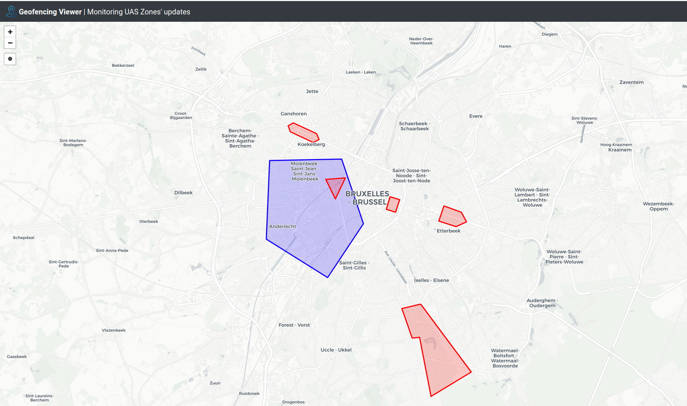

# Geofencing Service Deployment

## Overview
This document describes the procedure to get up and running a Geofencing Service demo platform which enables external 
client systems to get information about existing UAS zones as well as subscribe to receive updates about UAS zones over 
specific geographic areas. Based on the SWIM-TI specifications, this demo utilises the AMQP v1.0 protocol in order to 
enable the `producer` (Geofencing Service) to publish real time UAS zones' updates and a `consumer` (Geofencing Viewer) 
to subscribe over one or more geograpfic areas receive the relevant information.

More specifically, the main services involved are:

- **Subscription Manager**: is the core of the whole system wrapping up the broker where the data flows through by managing its topics 
to be published and its queues to consume from. It is supposed to be broker agnostic and for this demo [RabbitMQ](https://www.rabbitmq.com/)
is used as a broker. Moreover it stores topics' and subscriptions' metadata in a [PostgreSQL](https://www.postgresql.org/)
database and it exposes a REST API based on the [OpenAPI](https://www.openapis.org/) specifications.
- **Geofencing Service**: is the main service of the demo which allows the creation and deletion of UAS zones. Moreover,
it acts as a wrapper on top of the Subscription Manager by managing geographic specific subscriptions and publishes 
relevant UAS zones' updates via the broker. The underlying data are stored in a [MongoDB](https://www.mongodb.com/) 
database while it also exposes all the aforementioned actions via a REST API.  
- **Geofencing Viewer** is the `consumer` implementation which subscribes over specific geographic areas (polygons) and 
get updates about creation/deletion of underlying UAS zones.

> Both Geofencing Service and Geofencing Viewer make use of the [pubsub-facades](https://github.com/eurocontrol-swim/pubsub-facades)
library which allows them to speak to the Subscription Manager, the brokeras well as with each other.

The platform is designed with a microservices approach and is run with [docker](https://docker.com).

Below you can see the architecture design diagram along with the relationships of the COTS as well as the internally developed
services and libraries:

TODO: Add architecture image

## Installation

### Step by step
The steps bellow will allow you to build and run the Geofencing Service demo from scratch. Make sure you follow them one by one in the given order.

#### Prerequisites
Before starting, make sure the following software is installed and working on your machine:
    
##### **Linux/Mac users**
   - [git](https://git-scm.com/downloads) which will be used to download the necessary repositories.
   - [docker](https://docs.docker.com/install/) which will be used to host and run the whole demo platform
   - [docker-compose](https://docs.docker.com/compose/install/) which will be used to orchestrate the deployment locally
   - [python](https://www.python.org/downloads/) which will be used to run python custom scripts 

##### **Windows users**
   - [Docker Toolbox on Windows](https://docs.docker.com/toolbox/toolbox_install_windows/) (which installs all the
   required tools and runs the Docker Engine via VirtualBox)
   - [python](https://www.python.org/downloads/) which will be used to run python custom scripts

###### Post-installation
   - Before using git commands you need to disable conversion of checked out files to Windows format:
        ```
        git config --global core.autocrlf input
        ```
   - Since Docker runs via VirtualBox, the various app/server sites involved in this demo will not be able to be accessed
     from your host machine unless you apply some port forwarding rules. You may find instructions about how to do it
     [here](https://www.simplified.guide/virtualbox/port-forwarding). The rules that we need are:

        | Name | Host port | Guest Port |
        |---|---|---|
        | broker | 15671 | 15671 |
        | https | 443 | 443 |
        | explorer | 3000 | 3000 |


#### Download repositories

> **NOTE**: The next steps are done on a Unix-like command line interface (CLI) for all users. Linux and Mac users can
> use any terminal application, however the Windows users will have to use the Docker CLI client that comes with Docker
> Toolbox on Windows. This can be accessed by starting **Docker Quickstart Terminal**.

First we need to clone this repository:

```shell
git clone https://github.com/eurocontrol-swim/geofencing-deploy.git
```

#### Configuration
Then we have to provide the necessary configuration of the services. This involves:

- setting up the required users
- application specific configuration

##### Geofencing users
Several users are required across the Geofencing platform such as users, broker users etc.

   - Usernames are predefined but you can also choose your own one. 
   - Passwords can take any character and need to be equal or longer than 10 characters. Each provided password will be 
checked for robustness and if it is deemed that it is not robust enough you will be re-prompted to choose a different one.

Use the following command to provide usernames and passwords:

```shell
cd geofencing-deploy
. ./geo.sh user_config
```

> the leading `.` before `./geo.sh user_config` is required in order the provided usernames and passwords to be exported as environment variables in the 
> host machine


The interaction shell then will look like:


```shell
GEOFENCING user configuration...
==========================

Subscription Manager admin user
 username [sm-admin]: 
 password: 

Geofencing Service user for Subscription Manager
 username [geofencing-service-sm]: 
 password: 

Geofencing Viewer user for Geofencing Service
 username [geofencing-viewer]: 
 password: 

Database user
 username [geo]: 
 password: 

Geofencing Viewer  user for the broker
 username [geofencing-viewer-broker]: 
 password: 

Geofencing Viewer user for Subscription Manager
 username [geofencing-viewe-smr]: 
 password: 
The password is not strong enough. Please try again.
 password: 

Broker Management user
 username [broker-mgmt]: 
 password: 

Broker admin user
 username [broker-admin]: 
 password: 

```

You can verify that the provided usernames and passwords were exported as environment variables by issuing the following
command:

```shell
env
```


##### Application config files
Under the services folder you can find one folder per app containing a `config.yml` file. 

These are already pre-configured but you may want to update the configuration of Geofencing Viewer and more specifically
the part that defines the initial UAS Zones filter which will be used to fetch existing UAS Zones upon initialization:

```yaml
INITIAL_UAS_ZONES_FILTER:
  airspaceVolume:
    polygon:
      - LAT: 50.901767
        LON: 4.371125
      - LAT: 50.866953
        LON: 4.224330
      - LAT: 50.788595
        LON: 4.342881
      - LAT: 50.846430
        LON: 4.535647
      - LAT: 50.901767
        LON: 4.371125
    lowerLimit: 0
    upperLimit: 100000
    lowerVerticalReference: 'WGS84'
    upperVerticalReference: 'WGS84'
  startDateTime: '2020-01-01T00:00:00+01:00'
  endDateTime: '2021-01-01T00:00:00+01:00'
  regions:
    - 1
  requestID: '1'

```

### Deployment
For the deployment process you can use the provided `shell` script `geo.sh`. Before using it though make it
executable with the following command:

```shell
chmod +x geo.sh
```

Moreover you can see the available options of this script with:
```shell
./geo.sh help
Usage: geo.sh [COMMAND] [OPTIONS]

Commands:
    user_config     Prompts for username/password of all the GEOFENCING related users
    build           Clones/updates the necessary git repositories and builds the involved docker images
    provision       Provisions the Subscription Manager with initial data (users)
    start           Starts up all the GEOFENCING services
    stop            Stops all the services
    stop --clean    Stops all the services and cleans up the containers
    status          Displays the status of the running containers

```

In order to get the demo platform up and running we first need to download the necessary repositories and build the 
involved docker images with the following command:
 
```shell
./geo.sh build
```

> The first time you run this command it will take some time because of the download/build of docker images.

> this has to be run only the first time we start GEOFENCING

After the necessary images are downloaded we are ready to get the services up and running. Before that
we'll need to provision the Subscription Manager, the Broker and the Geofencing Service with some initial data about 
the involved users and this can be done with:
 
```shell
./geo.sh provision
```

> this has to be run only the first time we start Geofencing

and then we can start the services:

```shell
./geo.sh start
```

In order to make sure that all services (docker containers) are running you can run:
```shell
./geo.sh status
```

and you should see something similar to:
```shell
CONTAINER ID        IMAGE                  COMMAND                  CREATED             STATUS              PORTS                                                                     NAMES
c48d7d70160f        geofencing-viewer      "bash /app/entry.sh"     2 seconds ago       Up 1 second         0.0.0.0:3000->3000/tcp                                                    geofencing_viewer
114d7dd82869        swim-nginx             "nginx -g 'daemon of…"   2 seconds ago       Up 1 second         80/tcp, 0.0.0.0:80->8000/tcp, 0.0.0.0:443->8443/tcp                       nginx
757aeeea5524        geofencing-service     "bash /app/entry.sh"     2 seconds ago       Up 2 seconds                                                                                  geofencing_service
19a009729c9a        subscription-manager   "/usr/bin/tini -- ba…"   3 seconds ago       Up 2 seconds                                                                                  subscription_manager
8b7183b7c410        swim-mongo             "docker-entrypoint.s…"   12 seconds ago      Up 12 seconds       0.0.0.0:27017->27017/tcp                                                  mongo
b69511af5a95        rabbitmq_amqp10        "docker-entrypoint.s…"   20 seconds ago      Up 19 seconds       4369/tcp, 5671-5672/tcp, 15672/tcp, 25672/tcp, 0.0.0.0:15671->15671/tcp   rabbitmq
3e3f55ba98bf        swim-postgres          "docker-entrypoint.s…"   20 seconds ago      Up 19 seconds       5432/tcp                                                                  postgres

```

### Usage

#### Geofencing Viewer
As soon as the platform is up and running, you can point your browser to [http://0.0.0.0:3000](http://0.0.0.0:3000) in
order to access the Geofencing Viewer and play around. There you can subscribe over specific geographic areas by creating
polygons (blue polygons) and providing some additional necessary information. As soon an UAS Zone (red polygons) creation 
or deletion occurs it will depicted under your chosen area (as long as the subscription is active, i.e. not paused). 
The interface will look similar to the below image:


> NOTE: Geofencing Viewer is supposed to be a client application, .i.e out of the scope of Geofencing Service platform. 
> However, for the purpose of this demo it comes together with the rest of the services, but it runs as a standalone web 
> application not passing through the web server.



#### Geofencing Service
Additionally, you may access the Geofencing Service OpenAPI specs site using the following link:
[https://localhost/geofencing-service/api/1.0/ui/#/](https://localhost/geofencing-service/api/1.0/ui/#/). Notice
that you may get a warning saying the the connections if not safe. This is expected as this demo uses mock certificates
and not real ones. In there you can interact with it by observing the various transactions of subscriptions 
that happen while using Geofencing Viewer and/or create/delete/retrieve UAS Zones. You can login using the user and 
password you provided during the user configuration step earlier. The interface will look like the following image:


#### Subscription Manager
Moreover, you may access the Subscription Manager OpenAPI specs site using the following link:
[https://localhost/subscription-manager/api/1.0/ui/#/](https://localhost/subscription-manager/api/1.0/ui/#/). Notice
that you may get a warning saying the the connections if not safe. This is expected as this demo uses mock certificates
and not real ones. In there you can observe the various transactions of topics and subscriptions that happen while 
Geofencing Service is interacting with it. You can login using the user and password you provided during the user 
configuration step earlier. The interface will look like the following image:


#### RabbitMQ Management
Lastly, you can also access the RabbitMQ management page using the following link:
[https://localhost:15671/#/](https://localhost:15671/#/). Notice that you may get a warning saying the the connections 
if not safe. This is expected as this demo uses mock certificates and not real ones. In there you can observe the queues
that are created/deleted while using Geofencing Viewer as well as statistics about the flow of the incoming messages. You
can login using the user and password you provided during the user configuration step earlier. The interface will look
similar to the following image:


### Stopping the Platform


In order to tear the platform down you can do:

```shell
./geo.sh stop
```

or if you also want to remove completely the involved docker containers you can do:
```shell
./geo.sh stop --clean
```

In case there is a change on the involved repositories you can update them by calling:
```shell
./geo.sh stop --clean  # if GEOFENCING is up running
./geo.sh build
```
